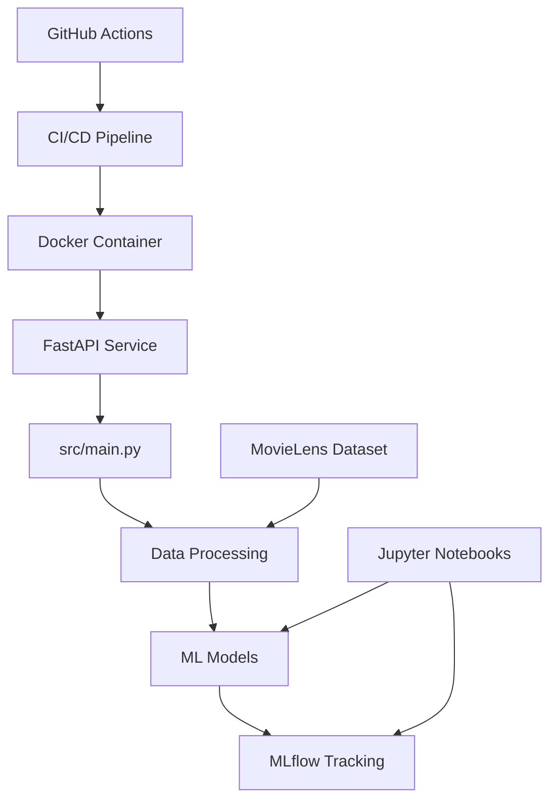

# 🎬 LatentLens — Hybrid Movie Recommender

<p align="center">
  
  
  
  
  
  
  
  
  
  
</p>

> LatentLens blends popularity baselines with collaborative filtering (KNN, SVD) to deliver movie recommendations at scale. Built with a clean src-layout, MLflow tracking, and a FastAPI service layer.

---

## 🚦 Current Status & Context

- **API**: FastAPI app with `/health` endpoint; recommendation endpoints in development.
- **CI/CD**: GitHub Actions pipeline ✅ (Docker build + tests).
- **Experiments**: MLflow tracking locally (`./mlruns/`); artifacts gitignored.
- **Docker**: Multi-stage build optimized for production.
- **Tests**: Passing locally and in CI using pytest.

---

## 🚀 Cómo Ejecutarlo

### Opción 1: Docker (Recomendado)

**Requisitos**: Docker Desktop instalado y ejecutándose.

```bash
# 1. Clonar el repositorio
git clone https://github.com/Gatoco/LatentLens.git
cd LatentLens

# 2. Construir la imagen Docker
docker build -t latentlens:latest .

# 3. Ejecutar el contenedor
docker run --rm -p 8000:8000 latentlens:latest

# 4. Verificar que funciona
curl http://localhost:8000/health
# Respuesta esperada: {"status":"ok"}
```

### Opción 2: Entorno Local

**Requisitos**: Python 3.10, Git.

```bash
# 1. Crear entorno virtual
python -m venv venv

# 2. Activar entorno (Windows)
./venv/Scripts/Activate.ps1
# O en Linux/Mac:
# source venv/bin/activate

# 3. Instalar dependencias
pip install -r requirements.txt
pip install -e .

# 4. Ejecutar tests (opcional)
python -m pytest -q

# 5. Iniciar la API
python -m uvicorn src.main:app --reload --host 0.0.0.0 --port 8000

# 6. Verificar funcionamiento
# Navegar a: http://localhost:8000/health
```

### Ejecutar Experimentos MLflow

```bash
# 1. Asegurar que el entorno esté activado
# 2. Ejecutar notebooks Jupyter
jupyter notebook notebooks/

# 3. Ver experimentos en MLflow UI (opcional)
mlflow ui --backend-store-uri ./mlruns
# Navegar a: http://localhost:5000
```

---

## 🏗️ Arquitectura Técnica

### Stack Principal



### Componentes Clave

#### 🔧 **API Layer (FastAPI)**
- **Ubicación**: `src/main.py`
- **Responsabilidad**: Endpoints REST, validación de requests, serialización JSON
- **Endpoints actuales**:
  - `GET /health` - Health check para monitoring
  - **Próximos**: `POST /recommend`, `GET /movies/{id}`

#### 📊 **Data Processing Layer**
- **Ubicación**: `src/data_loader.py`, `src/preprocessing.py`
- **Responsabilidad**: 
  - Carga y limpieza de datos MovieLens
  - Transformación de ratings a matrices sparse
  - Filtrado por actividad de usuarios y popularidad de items

#### 🤖 **ML Models Layer**
- **Frameworks**: scikit-surprise, scikit-learn
- **Modelos implementados**:
  - **Baseline**: Weighted popularity (reduce bias por pocos votos)
  - **Collaborative Filtering**: KNN (cosine similarity), SVD (matrix factorization)
- **Evaluación**: RMSE, cross-validation

#### 📈 **MLflow Tracking**
- **Ubicación**: `./mlruns/` (local), ignorado por Git
- **Tracking**: Métricas (RMSE), parámetros (k_neighbors, n_factors), artifacts (modelos)
- **Reproducibilidad**: Cada experimento registra código, datos y entorno

#### 🐳 **Containerization**
- **Multi-stage build**:
  - **Builder stage**: Python 3.10 full + build tools + git
  - **Runtime stage**: Python 3.10-slim + app code
- **Optimizaciones**: Layer caching, pip wheels, non-root user

#### ⚙️ **CI/CD (GitHub Actions)**
- **Trigger**: Push/PR a `main`
- **Pipeline**: 
  1. Checkout código
  2. Build imagen Docker
  3. Run tests dentro del contenedor
- **Beneficio**: Tests en entorno idéntico a produccióner">
  
  
  
  
  
  
  
  
</p>

> LatentLens blends popularity baselines with collaborative filtering (KNN, SVD) to deliver movie recommendations at scale. Built with a clean src-layout, MLflow tracking, and a FastAPI service layer.

---

## 🚦 Current Status & Context

- API: minimal FastAPI app exposed at `/health` for liveness checks; recommendation endpoints planned.
- Experiments: MLflow runs stored locally under `./mlruns/` (ignored by git).
- Docker: multi-stage build updated; builder includes `git` so pip can install git-based deps.
- Tests: green locally via `pytest` (src-layout fixed with `src/__init__.py`).
- Repo hygiene: history cleanup in progress to remove large MLflow artifacts previously committed before pushing to GitHub.

---

## ⚡ Quickstart (Local)

Requirements: Python 3.10, Git. On Windows PowerShell:

```powershell
python -m venv venv
./venv/Scripts/Activate.ps1
pip install -r requirements.txt

# IMPORTANT: Install package in editable mode (fixes import errors)
pip install -e .

python -m pytest -q   # optional: run tests

# Run the API (dev)
python -m uvicorn src.main:app --reload --host 127.0.0.1 --port 8000
# Health check
# http://127.0.0.1:8000/health
```

---

## � Docker

Multi-stage image (builder builds wheels; runtime uses slim). Build and run:

```powershell
docker build -t latentlens:local .
docker run --rm -p 8000:8000 latentlens:local
```

Notes:
- `mlruns/` and large artifacts are ignored; mount volumes if you want to persist runs.
- The builder stage installs `git` to support git-based requirements during pip install.

---

## 🧩 Tech Stack

- Python 3.10 • FastAPI • Uvicorn
- scikit-learn • pandas • scikit-surprise (SVD, KNN)
- MLflow for experiment tracking
- Jupyter for exploration (see `notebooks/`)

---

## 📊 Dataset

Uses [MovieLens 25M](https://grouplens.org/datasets/movielens/25m/).

- Expected path (local): `./data/ml-25m/` with `ratings.csv`, `movies.csv`, etc.
- Data and artifacts are ignored by git to keep the repo lean.

Key characteristics: high sparsity, long-tail items, power users, genre overlap.

---

## 🛠️ Methods (Concise)

- Baseline: weighted popularity with minimum votes to reduce small-sample bias.
- Collaborative filtering:
  - User–item sparse matrix with activity/popularity filtering.
  - KNN (cosine, brute force) and SVD (Surprise) with RMSE evaluation.
- Tracking: MLflow metrics/params/artifacts for reproducibility.

---

## 📁 Project Structure

```text
data/            # MovieLens dataset (local only, gitignored)
notebooks/       # EDA and MLflow experiments
src/             # FastAPI app and utilities (src-layout)
  ├─ main.py     # API app with /health
  └─ ...
requirements.txt
setup.py
```

---

## 🗺️ Roadmap

- [x] Baseline model (popularity)
- [x] Collaborative filtering (KNN, SVD) + RMSE
- [x] MLflow local tracking
- [x] Docker multi-stage build (builder + slim)
- [x] CI/CD pipeline with GitHub Actions
- [x] Comprehensive documentation
- [ ] REST endpoints for recommendations (`/recommend`, `/movies/{id}`)
- [ ] Model serving and caching layer
- [ ] Hyperparameter sweeps and model registry
- [ ] Production deployment (AWS/GCP/Azure)
- [ ] Monitoring and logging

---

## 🤝 Contributing

PRs are welcome. Please avoid committing data or MLflow artifacts. For experiments, keep runs under local `mlruns/`.

---

## 📄 License

MIT License.
